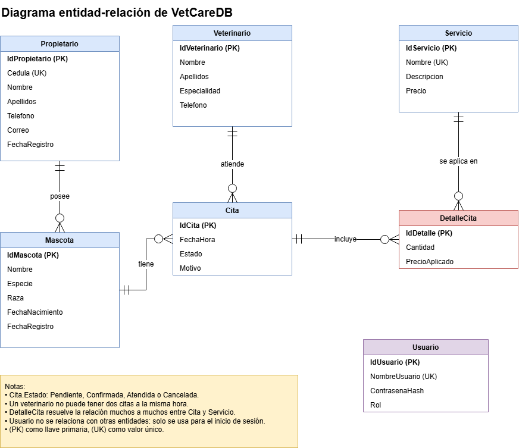
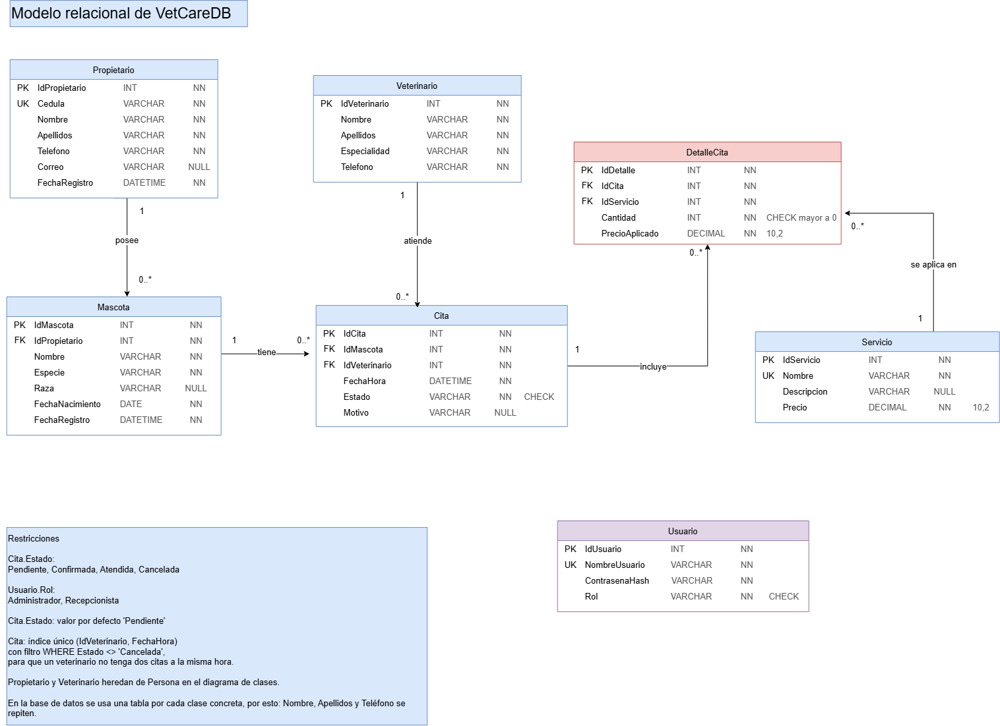
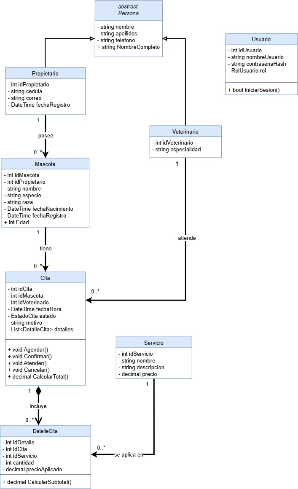

# VetCare

Sistema de escritorio para administrar una clínica veterinaria pequeña: propietarios, mascotas, veterinarios, servicios y citas. Hecho con C#, Windows Forms y SQL Server.

Proyecto de Programación II.
Ingeniería de Sistemas.

> **Estado:** primer avance (diseño y base de datos). 
La aplicación está en desarrollo aún.

## Qué hace

- Inicio de sesión con dos roles: Administrador y Recepcionista.
- Registro, consulta, modificación y eliminación de propietarios, mascotas, veterinarios y servicios.
- Agenda de citas con estados (Pendiente, Confirmada, Atendida, Cancelada). Un veterinario no puede tener dos citas a la misma hora.
- Servicios aplicados en cada cita, con subtotal y total.
- Búsquedas y validación de datos.

## Tecnologías

C#, Windows Forms, Visual Studio 2026, SQL Server Express, SQL Server Management Studio (SSMS), Git y GitHub.

## Estructura

```
VetCare/
├── database/            # VetCareDB.sql (script de creación)
├── docs/
│   ├── diagramas/       # ER, modelo relacional y diagrama de clases
│   └── avance.pdf       # documento del avance
└── src/
    ├── VetCare.UI/      # formularios (Windows Forms)
    ├── VetCare.Logica/  # clases y reglas del negocio
    └── VetCare.slnx     # solución de Visual Studio
```

El código sigue una arquitectura de tres capas: presentación, lógica y datos.

## Base de datos

`VetCareDB` se crea en SQL Server con el script `database/VetCareDB.sql`. Tiene siete tablas:

| Tabla | Llave primaria | Llaves foráneas | Qué guarda |
|-------|----------------|-----------------|------------|
| Propietario | IdPropietario | – | Dueños de las mascotas (cédula única) |
| Mascota | IdMascota | IdPropietario | Datos de cada mascota |
| Veterinario | IdVeterinario | – | Veterinarios que atienden |
| Cita | IdCita | IdMascota, IdVeterinario | Fecha, hora, estado y motivo |
| Servicio | IdServicio | – | Catálogo de servicios con su precio |
| DetalleCita | IdDetalle | IdCita, IdServicio | Servicios aplicados en una cita, con cantidad y precio cobrado |
| Usuario | IdUsuario | – | Inicio de sesión y rol |

`DetalleCita` resuelve la relación muchos a muchos entre `Cita` y `Servicio`. El diccionario de datos completo está en el documento del avance, dentro de `docs/`.

### Diagrama entidad-relación



### Modelo relacional



### Diagrama de clases



## Cómo ejecutarlo

Requisitos: Windows, Visual Studio, SQL Server Express y SSMS.

1. Clonar el repositorio: `git clone https://github.com/Nymphahri/VetCare.git`
2. Abrir SSMS y ejecutar el script `database/VetCareDB.sql` para crear `VetCareDB`. Se puede correr más de una vez: solo crea lo que no existe y no borra datos.
3. Abrir `src/VetCare.slnx` en Visual Studio y ejecutar el proyecto `VetCare.UI`.

## Autoría

Estudiante de ingeniería en sistemas: Grace Romero Sanabria.

Uso de inteligencia artificial: ver la declaración en el documento del avance.